# GitHub + OpenCode 集成配置

## 📁 文件结构

```
workspace/
├── github-actions-opencode-review.yml    # GitHub Actions workflow 配置
├── GITHUB_ACTION_SETUP.md                # 详细配置指南
├── setup-github-action.ps1               # 一键配置脚本
└── README_GITHUB_INTEGRATION.md          # 本文件
```

## 🎯 快速开始

### 方法一：使用 PowerShell 脚本（推荐）

```powershell
# 一键配置
.\setup-github-action.ps1 -RepoPath "C:\path\to\your\repo"

# 或者指定 API Key
.\setup-github-action.ps1 -RepoPath "C:\path\to\repo" -OpenCodeApiKey "sk-..."
```

### 方法二：手动配置

1. 复制 workflow 文件到 `.github/workflows/`
2. 在 GitHub 添加 `OPENCODE_API_KEY` Secret
3. 提交并推送配置

## 📊 Workflow 功能

### 触发条件

- ✅ PR 创建/更新/重新打开
- ✅ PR 标记为 Ready
- ✅ 手动触发

### 审查流程

```mermaid
graph LR
    A[PR 创建/更新] --> B{Draft?}
    B -->|No| C[Checkout 代码]
    B -->|Yes| D[跳过审查]
    C --> E[安装 OpenClaw]
    E --> F[配置 OpenCode Zen]
    F --> G[检测变更文件]
    G --> H[AI 代码审查]
    H --> I[生成报告]
    I --> J[发布到 PR 评论]
```



### 输出内容

- 📝 详细的代码审查报告
- 🔍 文件级别的审查意见
- ⚠️ 潜在问题标记
- ✅ 代码质量评估

## 🔐 安全配置

### GitHub Secrets

需要在仓库中添加以下 Secret：

| Secret | 说明 | 必填 |
|--------|------|------|
| `OPENCODE_API_KEY` | OpenCode Zen API Key | ✅ |

### Workflow 权限

```yaml
permissions:
  contents: read      # 读取代码
  pull-requests: write # 发布评论
  issues: write       # 创建 issue（可选）
```

## 📝 使用示例

### 标准 PR 审查

创建 PR 后自动触发：

```yaml
on:
  pull_request:
    types: [opened, synchronize, ready_for_review]
```

### 手动触发审查

```yaml
workflow_dispatch:
  inputs:
    pr_number:
      description: 'Pull Request 编号'
      required: false
```

### 指定分支

```yaml
branches: [main, master, develop]
```

## 🛠️ 自定义配置

### 修改审查的文件类型

编辑 `github-actions-opencode-review.yml`：

```yaml
files: |
  **/*.js
  **/*.ts
  **/*.py
  # 添加你需要的文件类型
```

### 跳过特定目录

```yaml
changed-files:
  files: |
    **/*.ts
    **/*.js
  excluded_files: |
    **/test/**
    **/*.test.ts
    **/*.spec.ts
```

### 自定义审查提示词

```yaml
openclaw run "请重点审查：
1. 安全性问题
2. 性能瓶颈
3. 代码可维护性
文件：$file"
```

## 📊 输出示例

### PR 评论

```markdown
# 代码审查报告

## 变更概览
- PR: #123
- 标题：feat: add authentication
- 变更文件：5

## 审查意见

### src/auth/login.js
⚠️ 发现 3 个问题：
1. 缺少输入验证
2. 错误处理不完善
3. 建议添加日志

### src/utils/helpers.ts
✅ 代码质量良好

---
审查完成时间：2026-02-28T04:20:25Z
```

## 🐛 故障排查

### Workflow 不运行

```bash
# 检查 Actions 是否启用
gh api repos/{owner}/{repo}/actions/permissions

# 启用 Actions
gh api -X PATCH repos/{owner}/{repo}/actions/permissions \
  -f enabled=true
```

### 权限错误

确保仓库设置中：
1. Settings → Actions → General
2. Workflow permissions: Read and write
3. ✅ Allow GitHub Actions to create and approve pull requests

### API Key 无效

1. 验证 OpenCode API Key 是否正确
2. 检查 OpenCode Dashboard 用量限制
3. 重新生成 API Key

## 📚 相关资源

- [OpenClaw 文档](https://docs.openclaw.ai)
- [GitHub Actions 文档](https://docs.github.com/actions)
- [OpenCode Zen](https://opencode.dev)
- [GitHub CLI](https://cli.github.com)

## ⚡ 高级用法

### 多仓库配置

```yaml
name: Multi-Repo Review
on:
  repository_dispatch:
    types: [review-request]

jobs:
  review:
    runs-on: ubuntu-latest
    steps:
      - uses: actions/checkout@v4
      - run: openclaw run "审查代码"
```

### 条件审查

```yaml
# 只在特定条件下审查
if: |
  github.event.pull_request.additions > 100 ||
  github.event.pull_request.changed_files > 5
```

### 并行审查

```yaml
strategy:
  matrix:
    file_type: [js, ts, py]
    
jobs:
  review:
    runs-on: ubuntu-latest
    steps:
      - uses: actions/checkout@v4
      - run: openclaw run "审查 ${{ matrix.file_type }} 文件"
```

---

**版本**: 1.0.0  
**更新时间**: 2026-02-28  
**维护**: OpenClaw Team