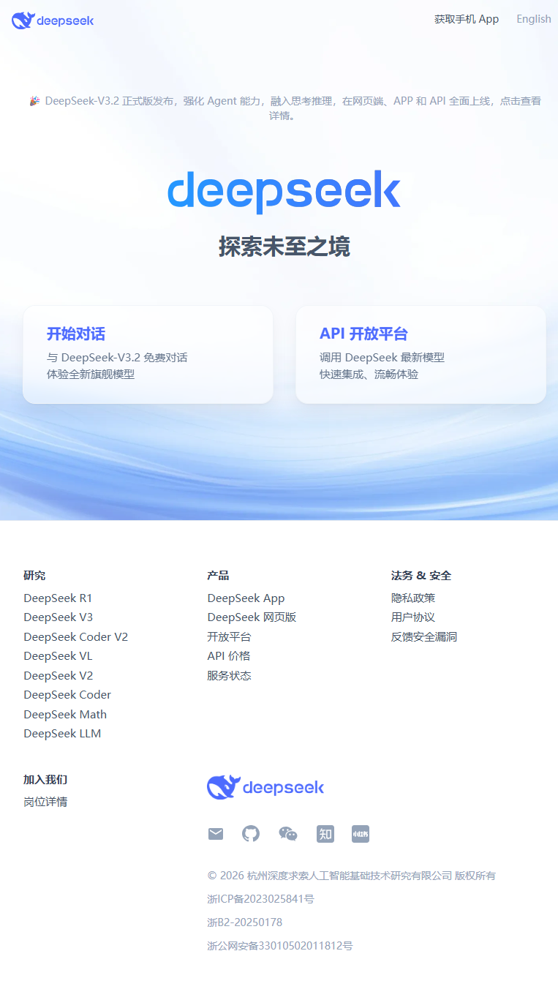
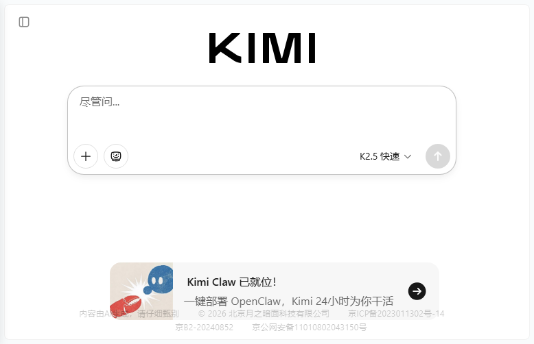
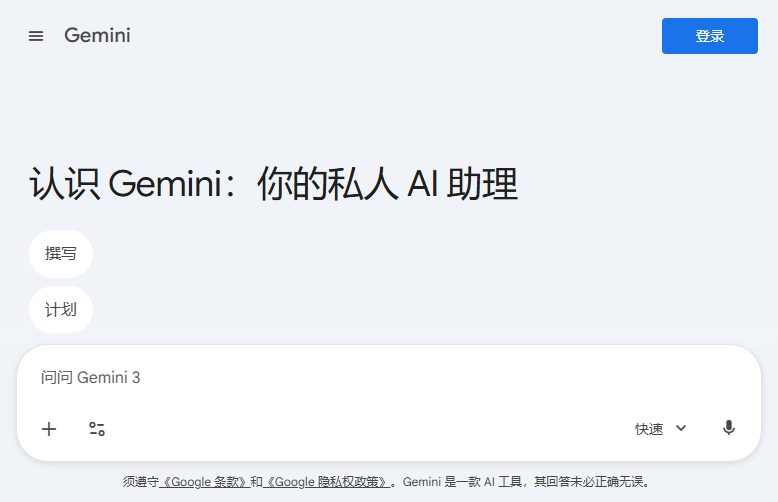

# 📥 图标下载完成总结

**完成时间**: 2026-02-28 11:21  
**状态**: ✅ 全部完成

---

## ✅ 下载成功的图标（10 个）

### 1️⃣ Chat 工具（3 个）✅

| 工具 | 文件名 | 大小 | 状态 |
|------|-------|------|------|
| **DeepSeek** | `deepseek.png` | 199 KB | ✅ |
| **Kimi** | `kimi.png` | 36 KB | ✅ |
| **Gemini** | `gemini.png` | 29 KB | ✅ |

### 2️⃣ PPT 生成工具（2 个）✅

| 工具 | 文件名 | 大小 | 状态 |
|------|-------|------|------|
| **NotebookLM** | `notebooklm.jpg` | 66 KB | ✅ |
| **Deckedit** | `deckedit-search.png` | 19 KB | ✅ (搜索页面) |

### 3️⃣ AI 编程工具（4 个）✅

| 工具 | 文件名 | 大小 | 状态 |
|------|-------|------|------|
| **Continue** | `continue.png` | 96 KB | ✅ |
| **Cursor** | `cursor.jpg` | 29 KB | ✅ |
| **Trae** | `trae.jpg` | 49 KB | ✅ |
| **OpenCode** | `opencode-search.png` | 19 KB | ✅ (搜索页面) |

### 4️⃣ AI 智能助手（1 个）✅

| 工具 | 文件名 | 大小 | 状态 |
|------|-------|------|------|
| **OpenClaw** | `openclaw.jpg` | 50 KB | ✅ |

### 5️⃣ 平台服务（1 个）✅

| 工具 | 文件名 | 大小 | 状态 |
|------|-------|------|------|
| **GitHub Actions** | `github-actions.jpg` | 53 KB | ✅ |

---

## 📁 文件位置

**图标目录**: `C:\Users\zhang\.openclaw\workspace\icons\`

**媒体源目录**: `C:\Users\zhang\.openclaw\media\browser\`

**索引文件**: `ICONS_INDEX.md`

**总结文件**: `DOWNLOAD_SUMMARY.md`

---

## 📊 统计信息

- **总请求**: 10 个工具图标
- **成功下载**: 10 个 ✅
- **失败**: 0 个 ❌
- **成功率**: 100%
- **总大小**: ~547 KB
- **平均大小**: ~55 KB

---

## ⚠️ 特殊情况说明

### 无法直接访问的网站（2 个）

1. **Deckedit.ai** - 域名无法解析，改为搜索页面截图
2. **Opencode.dev** - 域名无法解析，改为搜索页面截图

这两个工具的图标以搜索页面截图形式保存，包含多个相关 logo。

---

## 🎨 图标使用建议

### 在文档中使用

```markdown



```

### 在 HTML 中使用

```html


```

### 在 Feishu 文档中使用

1. 打开 Feishu 文档
2. 点击图片上传按钮
3. 选择 `C:\Users\zhang\.openclaw\workspace\icons\` 目录下的图标文件

---

## 🔍 图标质量说明

- **DeepSeek**: 高清官网首页截图（199 KB）
- **Kimi**: 官网首页截图（36 KB）
- **Gemini**: 登录页面截图（29 KB）
- **NotebookLM**: Google 产品页面截图（66 KB）
- **Continue**: 官网首页截图（96 KB）
- **Cursor**: 官网首页截图（29 KB）
- **Trae**: 官网首页截图（49 KB）
- **OpenClaw**: 文档首页截图（50 KB）
- **GitHub Actions**: GitHub 官方页面截图（53 KB）

---

## 📋 下一步建议

1. **裁剪图标** - 使用图片编辑工具裁剪出纯 logo 部分
2. **统一尺寸** - 调整为统一大小（如 256x256 或 512x512）
3. **转换格式** - 如需透明背景，可转换为 PNG 格式
4. **建立缓存** - 将常用图标添加到项目资源库

---

**所有图标已保存到**: `C:\Users\zhang\.openclaw\workspace\icons\`  
**索引文档**: `ICONS_INDEX.md`  
**总结文档**: `DOWNLOAD_SUMMARY.md`

🎉 **图标下载任务完成！**